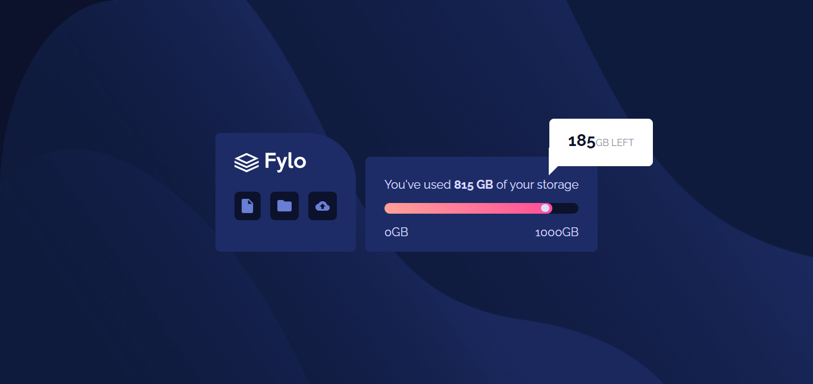
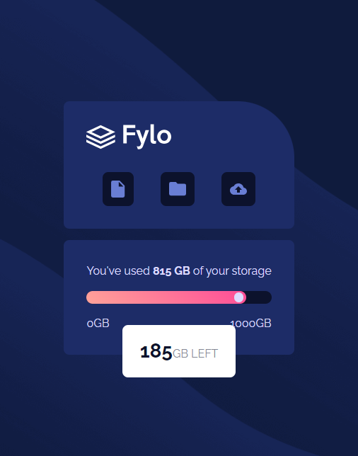

# Fylo Data Storage Compontent

This is a solution to the [Fylo data storage component](https://www.frontendmentor.io/challenges/fylo-data-storage-component-1dZPRbV5n) from [Frontend Mentor](https://frontendmentor.io)

- [Fylo Data Storage Compontent](#fylo-data-storage-compontent)
  - [Preview](#preview)
    - [Desktop](#desktop)
    - [Mobile](#mobile)
  - [Tools and Languages](#tools-and-languages)
    - [Languages](#languages)
    - [Technologies](#technologies)
    - [Tools](#tools)
    - [Others](#others)
  - [Process](#process)
  - [Links](#links)

## Preview

A glance at the project.

### Desktop



### Mobile



## Tools and Languages

### Languages

- HTML
- CSS

### Technologies

- `grid` for layouts
- `flex` for layouts
- `@font-face` to locally host fonts
- `@media` to make the site responsive

### Tools

- [Visual Studio Code](https://code.visualstudio.com)
- [Brave](https://brave.com)
- [Vercel](https://vercel.com)
- git
- GitHub

### Others

- [Vite](https://vitejs.dev)

## Process

This project is powered by Vite.

```sh
npm create vite@latest -- --template vanilla app

cd app

npm install

npm run dev
```

## Links

- [GitHub repository](https://github.com/Code-Beaker/fylo-data-storage-component)
- [Vercel](https://fylo-data-storage-code-beaker.vercel.app/)
